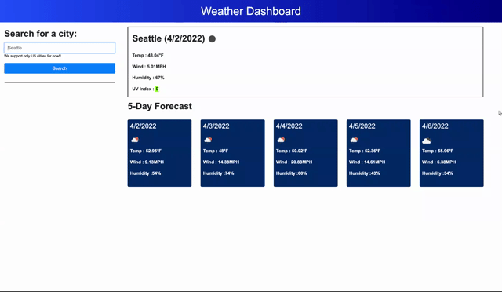

# weather-dashboard

This weather dashboard application usinf [OpenWeather One Call REST API](https://openweathermap.org/api/one-call-api) to present current and forecasted weather information for 5 days. This application uses HTML, CSS and javasacript. This dynamic application retrieves data from openweather.org, does DOM manipulation and localStorage to store user's recently searched city!!  This stores upto 12 recent searches in the application. 

## Tech Stack
- HTML
- CSS
- Bootstrap 
- javascript 

## Application Details 
GH Repo @ https://github.com/rajeswarivmarimuthu/weather-dashboard
  
Deployed @ https://rajeswarivmarimuthu.github.io/weather-dashboard/

## Demo 

